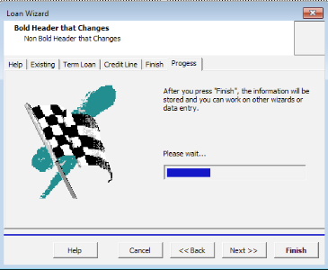
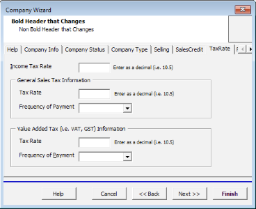
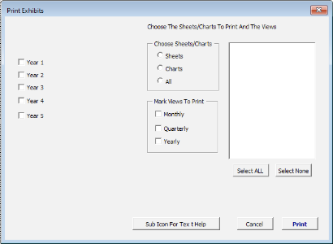

# Excel VBA Code Examples
 
## Overview

This repo houses various Excel VBA code modules that were used over the years for various projects and clients.

Note: Some of the projects do not work as they should since they were written in 32-bit and MS Office is now 64-bit. However, the vast majority of the code base can be used as-is for different projects.

## Excel XLA Files
### ABP_2006.xla

This is the Excel source code for the award-winning Adarus Business Plan. ABP was used to help small business owners create business plans in Excel and Word and provided a concise business plan package for submission to banks.

- Finalist for Shareware of the Year award (PC Magazine).
- 5-star review in PC World, PC Computing and PC Magazine.
- Included as part of a software add-on (included CD) in multiple technical and business planning books.

Note: This is actually a *.xls file and not a *.xla file. It is saved as *.xla for consistency, but contains worksheets for testing.

### BL_ExcelVBA_V1.0.xla

Generic set of code modules that have been collected over the years. The functions in these modules have been used in multiple projects.

Includes the following:
- Use of modal forms
- Looping through files in a directory, sheets, cell ranges
- Error handling
- Working with HTML
- Using worksheet cells to write SQL code

### BSIP AR.xla

This file represents the code necessary to process a number of data spreadsheets involved in converting from one system to another.

### Crosswalk Department Creation.xla

This project included validation for a data-entry form for use in the field coupled with the code necessary to process the data and combine for transfer into an Access database.

### Exhibit B (ADDIN).xla

This project was used as a replacement for a system where data was printed using a mainframe and then collated for over 100 people. The project imported EBCDIC data via text files and then did the necessary processing for submission to an online printer.

### ProcessData.xla

Raw data was exported from a web-based application. This xla file was used to format the data in the required reporting format.

### RiskMasterCoreBanking.xla

Created a utility that allowed the user to import a specific file to be validated and cleaned up for export into a format that the mainframe could utilize downstream.

## Screenshots

Loan Wizard Finish Screen

Company Wizard Tax Screen

Print Screen

## Tech Stack

Microsoft Excel 2000+ (32-bit only) with external libraries.

## License

[MIT](https://choosealicense.com/licenses/mit/)

  
## Acknowledgements

 - [Readme Templating Tool](https://readme.so)

